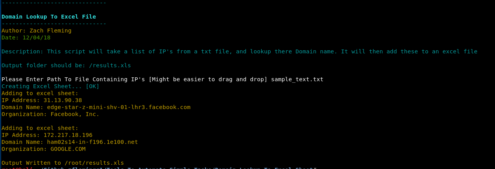

# Domain Lookup To Excel Sheet

This script will take a list of IP'S from a txt file, and lookup there Domain Name and the Organization that it belongs to. It will then add these results to an excel file

### Launching the program

To use the program simply open up a terminal navigate to the directory and run it with " python iplookup_to_excel.py"

### Sample Output

### Built With

* Python 2.7.14

### Authors

*** Zach Fleming --> zflemingg1@gmail.com

