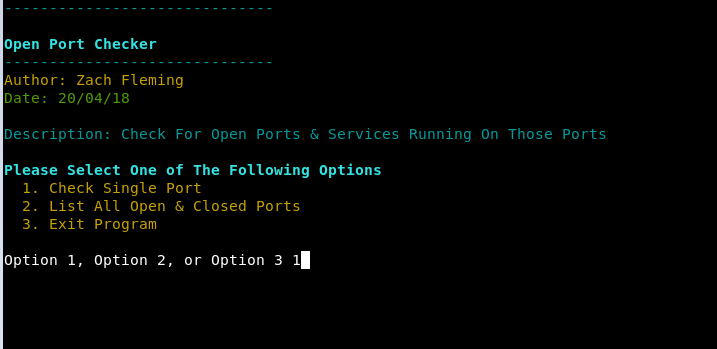
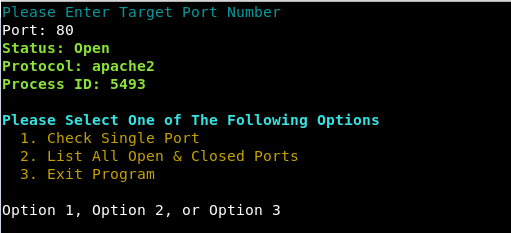
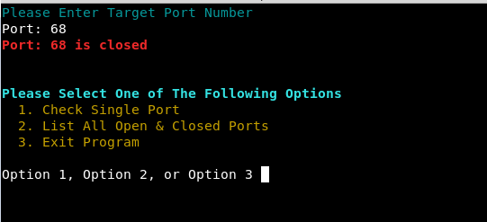

# IP Port Checker

This script will check every port running on the lcoal machine and check if the port is open or closed and what services or listening on each port

### Launching the program

To use the program simply open up a terminal navigate to the directory and run it with "python open_port_checker.py"

### Sample Output

### Built With

* Python 2.7.14

### Authors

*** Zach Fleming --> zflemingg1@gmail.com

